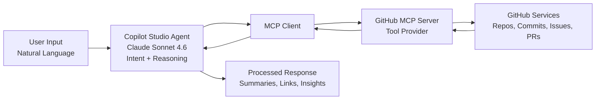

# Architecture

### Overview

The GitHub Navigator agent is built using Microsoft Copilot Studio and integrates with GitHub through the Model Context Protocol (MCP), enabling real-time interaction with repositories and development workflows.

### Architecture Flow
User → Copilot Studio Agent → MCP Client → GitHub MCP Server → GitHub APIs → Response

### Architecture Diagram

### Description

- **User Layer**:
The user interacts with the agent using natural language queries (e.g., searching repositories, retrieving commits, analyzing issues).

- **Copilot Studio Agent**:
The agent (powered by Claude Sonnet 4.6) interprets user intent, applies reasoning, and determines which tools to call based on the request.

- **MCP Client (Built-in in Copilot Studio)**:
Acts as a bridge between the agent and external systems, enabling secure and structured communication with MCP servers.

- **GitHub MCP Server**:
Exposes GitHub functionality (repositories, commits, issues, pull requests) as callable tools that the agent can dynamically discover and invoke.

- **GitHub APIs**:
The MCP server retrieves real-time data from GitHub APIs and returns structured results.

- **Response Layer**:
The agent processes the data, generates human-readable insights, and provides actionable responses with links and summaries.
