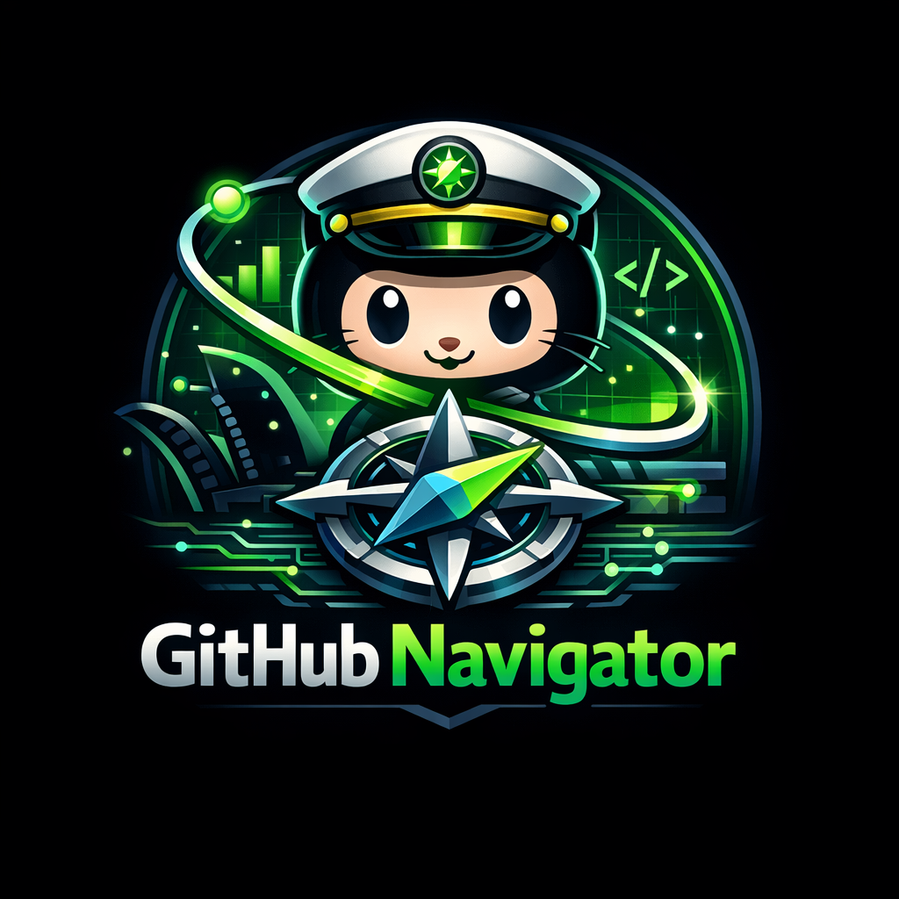
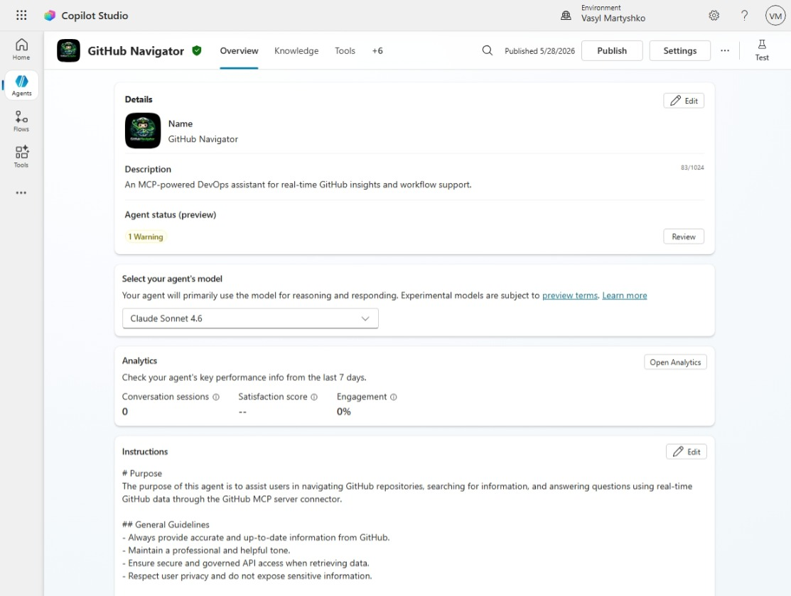
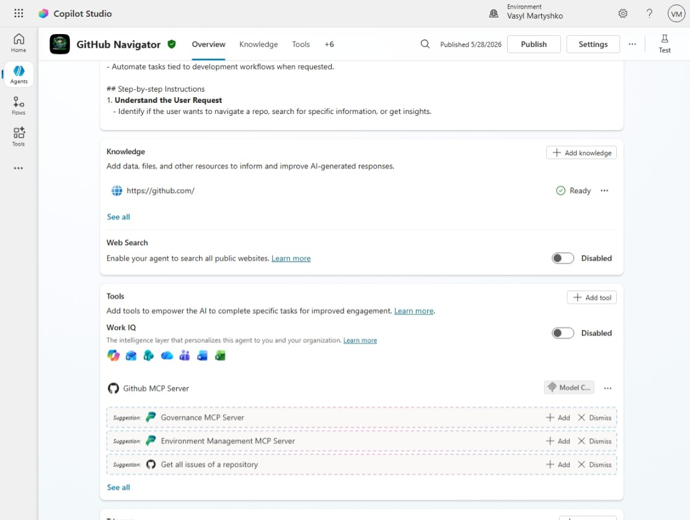
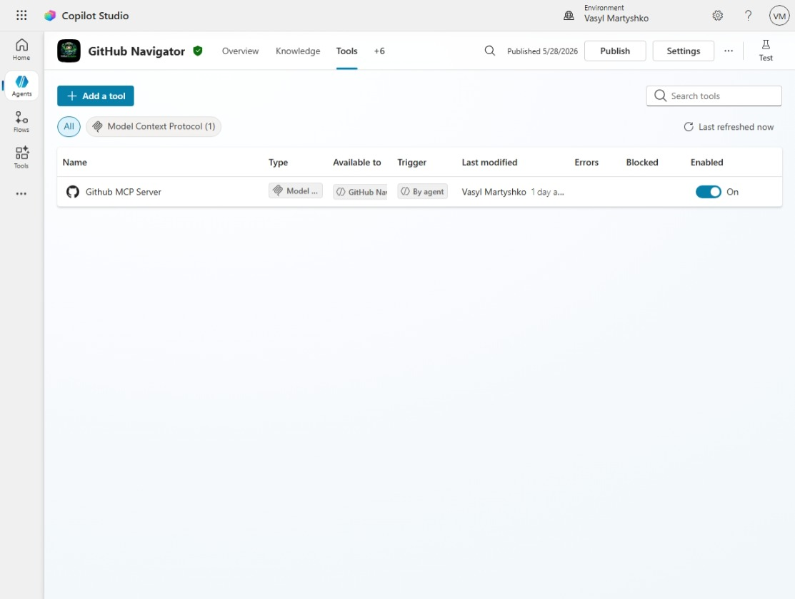
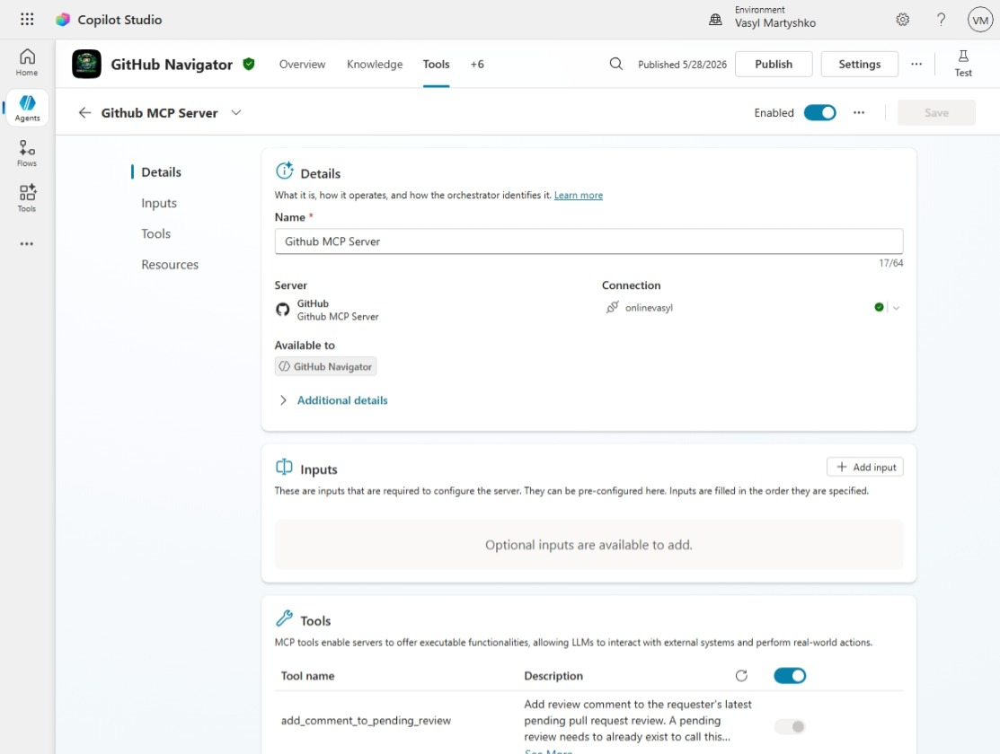
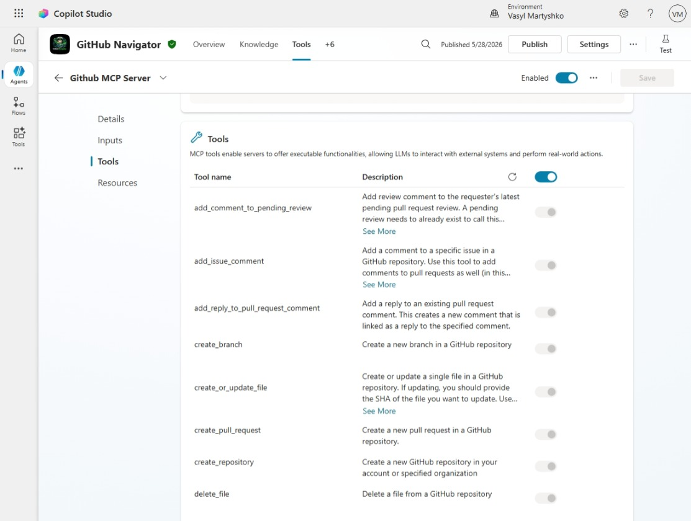
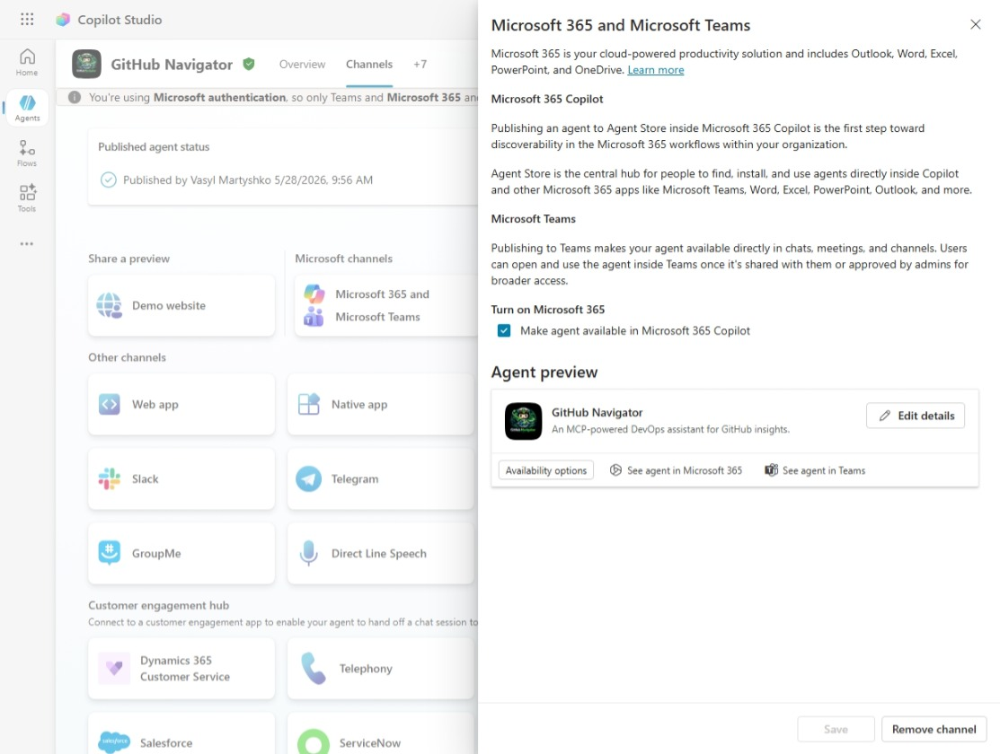
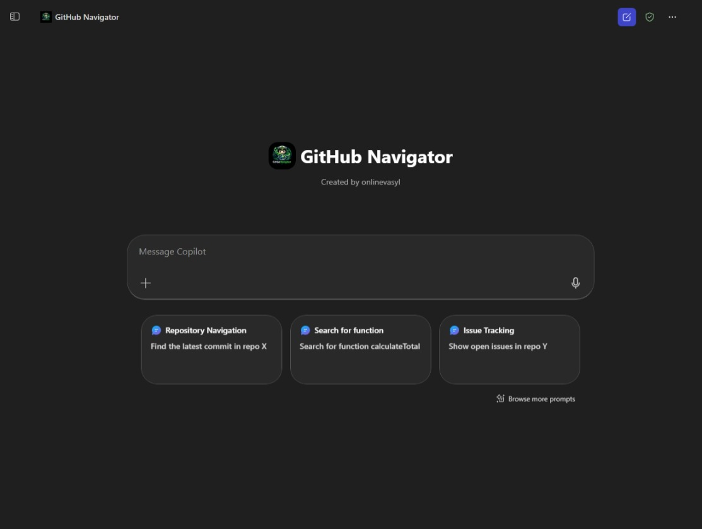

# GitHub Navigator

  

GitHub Navigator is an MCP-powered DevOps assistant built using Microsoft Copilot Studio and the GitHub Model Context Protocol (MCP).

It enables developers to interact with GitHub using natural language — searching repositories, exploring code, analyzing commits, retrieving real-time insights and taking action on developer workflows.

---

## Features

- Natural language GitHub navigation
- Cross-repository search (files, commits, PRs, issues)
- Real-time data via GitHub MCP server
- Direct links to GitHub resources
- Intelligent summarization and insights
- Secure API access via MCP connector

---

## Architecture

User → Copilot Studio Agent → MCP Client → GitHub MCP Server → GitHub APIs → Response

See full architecture: [Architecture](./ARCHITECTURE.md)

---
## Agent instructions

See agent instructions: [Agent instructions](./docs/agent-instructions.md)

---

## Technologies Used

- **Microsoft Copilot Studio** — Used to design, manage, and orchestrate the conversational agent, including instructions, tool integration, and deployment.

- **Model Context Protocol (MCP)** — Enables standardized integration with external tools, allowing the agent to dynamically discover and invoke GitHub capabilities.

- **GitHub MCP Server** — Provides access to GitHub repositories, commits, issues, and pull requests as callable tools for real-time interaction.

- **Claude Sonnet 4.6** — Serves as the primary reasoning model, handling natural language understanding, summarization, and multi-step reasoning.

- **GitHub APIs** — Used indirectly through the MCP server to fetch real-time repository data and insights.

- **Power Platform (Solutions & Governance)** — Used to package and manage the agent within a structured environment for lifecycle management.

- **Microsoft Teams & Microsoft 365 Copilot Channels** — Used as deployment channels to make the agent accessible to end users within productivity tools.

---

## Use Cases

- Find latest commits in a repo
- Search for functions across multiple repositories
- Explore issues and pull requests
- Understand codebase structure
- Generate insights across projects

---

## Video Demo

YouTube Video Demo

---

## Demo Scenarios

See: [Demo](./DEMO.md)

---

## Screenshots

### Agent Overview

### MCP Tools Integration

### Agent Channels

### Agent inside M365 Copilot

---

## Future Improvements

- Pull request automation (create / review / merge)
- CI/CD pipeline analysis
- Multi-step autonomous workflows
- Integration with additional MCP servers

---

## Author

Vasyl Martyshko
