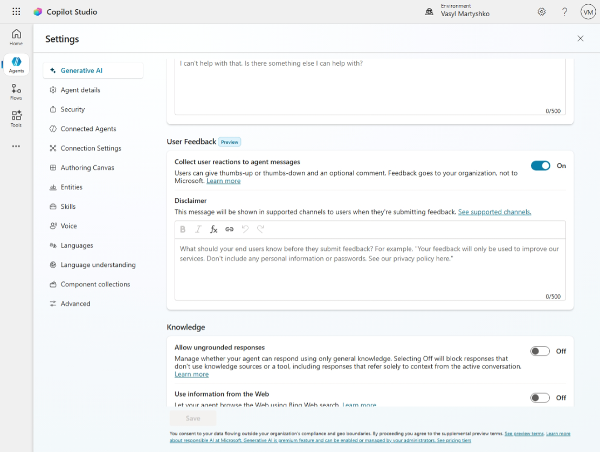

# Setup & Deployment Guide

## Table of Contents
- [Copilot Studio Configuration](#copilot-studio-configuration)
- [Testing & Validation](#testing--validation)
- [Troubleshooting](#troubleshooting)
- [Support & Resources](#support--resources)


## Copilot Studio Configuration

### Step 1: Create Agent
1. Open [Microsoft Copilot Studio](https://copilotstudio.microsoft.com/)
2. Click **Create blank agent**
4. Fill in **Name:** GitHub Navigator
5. **Language:** English (United States)
6. Choose your **Solution** and **Schema name**
7. Click **Create**
8. Edit:
   - **Agent's icon**
   - **Description:** An MCP-powered DevOps assistant for real-time GitHub insights and workflow support.
   - **Instructions:** See [Agent Instructions](./AGENT-INSTRUCTIONS.md)
9. **Select your agent's model:** Claude Sonnet 4.6
10. Add **Knowledge source:** https://github.com/
11. Disable Web Search


### Step 2: Add GitHub MCP Server Tool
1. Click **Add a Tool**
2. Choose **Model Context Protocol** to see the list of available MCP servers
3. Find in the list and select **GitHub MCP Server**
4. Create new connection using your GitHub credentials
5. Click **Add and configure**
6. Configure **Credentials to use**
7. Enable or disable MCP tools for your purpose
8. Save the configuration by clicking **Save** button


### Step 3: Add Suggested Prompts

1. Navigate to **Suggested Prompts** section
2. Add the following prompts one by one:<p>
Title: ```Repository Navigation```<br>
Prompt: ```Find the latest commit in repo X```<p>
Title: ```Search for function```<br>
Prompt: ```Search for function calculateTotal```<p>
Title: ```Issue Tracking```<br>
Prompt: ```Show open issues in repo Y```<p>
Title: ```Code Insights```<br>
Prompt: ```Explain recent changes```<p>

4. Save your changes  

### Step 4: User Feedback Collection

Implement User Feedback Collection in agent's settings:
1. Go to **Settings** → **Generative AI**
2. Enable **Collect user reactions to agent messages** in **User Feedback** section



### Step 5: Test the Agent
In the **Test** panel (right side), try:
- "Find the latest commit in onlinevasyl/github-navigator"
- "Search for function `getUserData` in repos"
- "Show open issues in my repositories"

### Step 6: Deploy to Teams/ M365 Copilot channels
1. Go to **Channels**
2. Choose Microsoft 365 and Microsoft Teams
3. Configure all necessary details for deployment channels.
4. Publish your agent to make it available for deployment inside Teams/ M365 Copilot or any other channel.


## Testing & Validation

### Test in Agent
1. Open the agent test panel
2. Try these scenarios:

**Basic Repository Search:**
```
Find repositories named "github-navigator"
```
Expected: Agent returns matching repositories with links.

**Code Search:**
```
Search for function "getUserData" across repos
```
Expected: Agent lists files and locations where function exists.

**Issue Tracking:**
```
Show all open issues in onlinevasyl/github-navigator
```
Expected: Agent returns list of open issues with titles and status.

**Commit Analysis:**
```
What was changed in the latest commit of onlinevasyl/github-navigator?
```
Expected: Agent shows files changed, additions, deletions, author, date.

**Cross-Repository Insights:**
```
Find all TODO comments across my repositories
```
Expected: Agent searches code and aggregates results.

### Validate Before Deployment
- [ ] Agent responds to GitHub queries correctly
- [ ] Links in responses work and are accurate
- [ ] Authentication persists across conversations
- [ ] Error messages are helpful (not raw API errors)
- [ ] Response times are acceptable

## Troubleshooting

### "GitHub connection not found"
**Solution:**
- Ensure you've signed in with correct account with all necessary permissions
- Check that OAuth window completed successfully
- Try revoking and re-authenticating
- Check all connections established during first test of the agent 

### "Access denied" or "Unauthorized"
**Possible causes:**
- GitHub account doesn't have access to the repository
- Personal Access Token (if used) expired
- Insufficient permissions

**Solution:**
- Verify you can access the repo on GitHub.com
- Re-authenticate with GitHub
- Check repository access permissions

### Tool returns "Repository not found"
**Check:**
- Repository name is correct
- Repository is public or you have access
- Repository actually exists on GitHub.com
- Try full path: `owner/repo` format

### Slow responses from GitHub
**Typical causes:**
- GitHub API is under load
- Large repository or complex queries
- Network latency

**Mitigation:**
- Retry the query
- Use more specific search terms
- Check [GitHub Status](https://www.githubstatus.com/) for outages
- Be patient (can take 10-30 seconds for complex searches)

### "Rate limit exceeded"
GitHub has API rate limits

**Solution:**
- Re-authenticate with GitHub (already done in Copilot Studio)
- Wait an hour for limit reset
- Use more specific queries to reduce requests
- Combine multiple queries into one agent request

### Agent ignores GitHub tools
**Check:**
- GitHub MCP Server is added to agent and configured correctly (see Step 2 above)
- Agent instructions are correct
- Web Search is disabled
- Test panel shows tools as available
- Refresh browser and try again

### Monitoring Agent Usage

In Copilot Studio:
1. Go to **Analytics**
2. View:
   - Total conversations
   - Common questions
   - Tools used most frequently
   - Error rates

## Next Steps

1. ✅ Add additional tools
2. ✅ Test core scenarios
3. 📋 Customize agent instructions for your team
4. 📤 Deploy to Teams or M365 Copilot
5. 📊 Monitor usage and gather feedback
6. 🔄 Iterate and improve agent behavior

## Support & Resources

- **GitHub MCP Server Documentation:** [Microsoft Learn - Github MCP Server](https://docs.microsoft.com/connectors/github/#github-mcp-server)
- **Copilot Studio Help:** [Microsoft Learn - Copilot Studio](https://learn.microsoft.com/en-us/microsoft-copilot-studio/)
- **GitHub API Docs:** [GitHub REST API](https://docs.github.com/en/rest)
- **GitHub Status:** [Check API Status](https://www.githubstatus.com/)

---

**Pro Tip:** Bookmark the [Agent Instructions](./AGENT-INSTRUCTIONS.md) to easily customize your agent's behavior and add new workflows over time.
